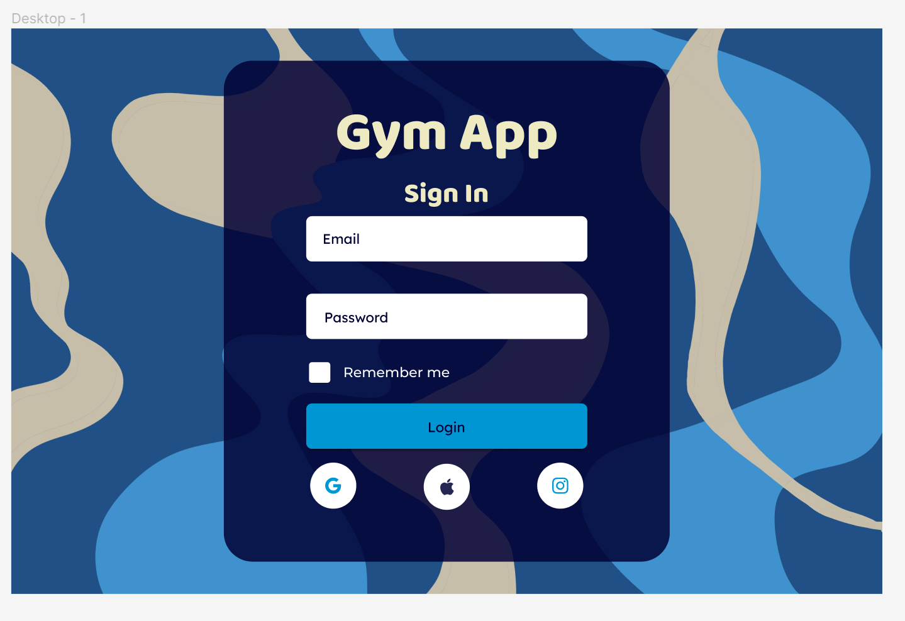

# Gym Reservation App 💪
Possible name: Pump Program

The goal is to reduce/eliminate the time spent waiting on others to finish using a machine/rack/bench at a gym by allowing people to see which equipment are open in advance and book a set amount of time on the equipment.

## Use Case
1. The user will start by identifying which split or muscle group they'd like to focus on for the workout.
2. The app will use the user's given data to identify optimal equipment for the workout. 
3. The app will determine the availability of the machine, and cluster machines with availablilities near each other in time. 
4. The user will be presented with a schedule of reps and sets for each workout and where to head to for the next workout.
5. If the user accepts, the equipment schedule will be booked for the user.

## Technologies
This is a two-tier application, with a thick client running both a simple UI as well as a database to track user data and equipment availbility.

- The frontend will be done in TypeScript and using React.JS. 
- The database is TBD.
- User authentication will be done through Auth0.

## Personal Goals
I am passionate about the gym and would like to reduce the amount of time I spend waiting for equipment.
I decided to pursue this project to teach my friends the technologies and frameworks I'm learning at my current internship.